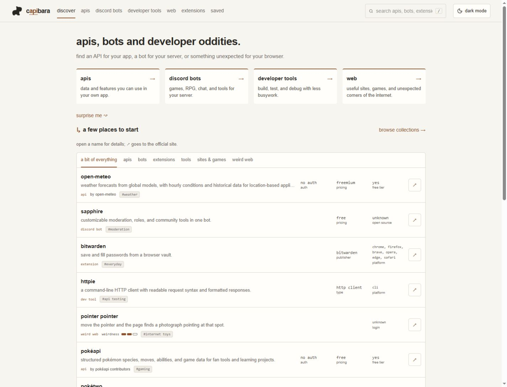
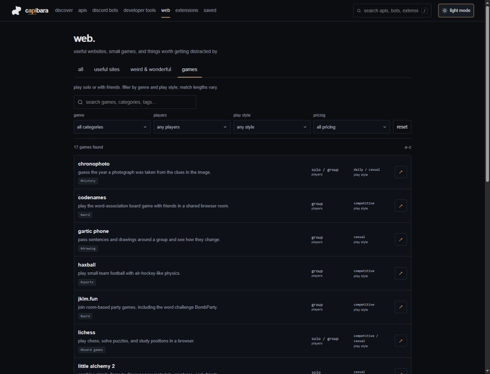
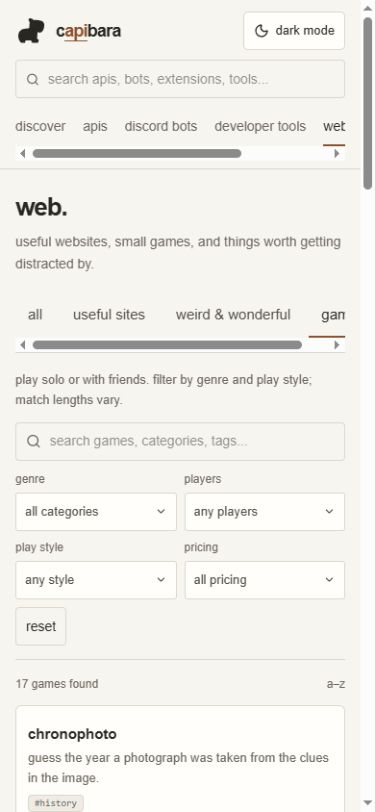

# capibara

apis, bots and developer oddities. a small, independent directory for finding useful tools and interesting corners of the web.



## inside the directory

| section | what you can find |
| --- | --- |
| apis | authentication, known pricing, free tiers, documentation, and request examples |
| discord bots | games, music, community tools, moderation, and reviewed invite links |
| developer tools | tools for building, testing, debugging, and working with data |
| extensions | browser helpers with platform and publisher information |
| web | useful websites, weird experiments, and browser games |

Search by name, description, provider, category, or tag. Narrow games by solo/group, genre, and play style; filter extensions by browser. Collections offer starting points, and random discovery finds something unexpected.

Save entries locally without an account. Light and dark themes follow you between pages. Saved entries stay in that browser and disappear if its site data is cleared.

<details>
<summary>games, dark mode, and mobile</summary>





</details>

## run locally

Requires Node.js 20.9+ and npm. No API keys or database setup needed.

```sh
git clone https://github.com/denisilhan/capybara.git
cd capybara
npm ci
npm run dev
```

Open [localhost:3000](http://localhost:3000). The product is named **capibara**; the repository keeps its original `capybara` URL.

For a production build:

```sh
npm run build
npm start
```

## catalog and sources

The catalog lives in [`src/data`](src/data). Each entry records sources and a review date. Unknown pricing is omitted from the interface, and unknown values are never treated as free. Direct Discord invites appear only for reviewed destinations.

Weirdness is a three-level editorial assessment, not a quality or popularity score. Legacy editorial values support some sorting and collection rules; they are not provider metrics. There are no live uptime, usage, or popularity claims.

Provider details can change. Review dates describe a source review, not a live availability guarantee. The original source audit is in [`docs/SOURCES.md`](docs/SOURCES.md); current notes live alongside each record.

To suggest an entry or correct a fact, [open an issue](https://github.com/denisilhan/capybara/issues) with its official URL and a short explanation.

## development

Next.js App Router, React, strict TypeScript, and CSS. No account system, API proxy, or tracking backend.

- `src/app/` — directory, collection, search, saved, and detail routes
- `src/components/` — shared directory and detail UI
- `src/data/` — catalog records, discovery picks, and collection rules
- `src/lib/` — search, filtering, sorting, counts, and verified links
- `tests/` — catalog invariants and route integration checks
- `public/design-lab.html` — the earlier naming and logo study

```sh
npm run lint
npm test
npm run build
```

With a local server running, `npm run test:routes` checks every catalog detail page, directory routes, 404s, redirects, and key rendering rules. Set `TEST_BASE_URL` to use a server other than `http://127.0.0.1:3000`.

See the [release review](docs/REVIEW.md) for the latest verification scope and limits.
