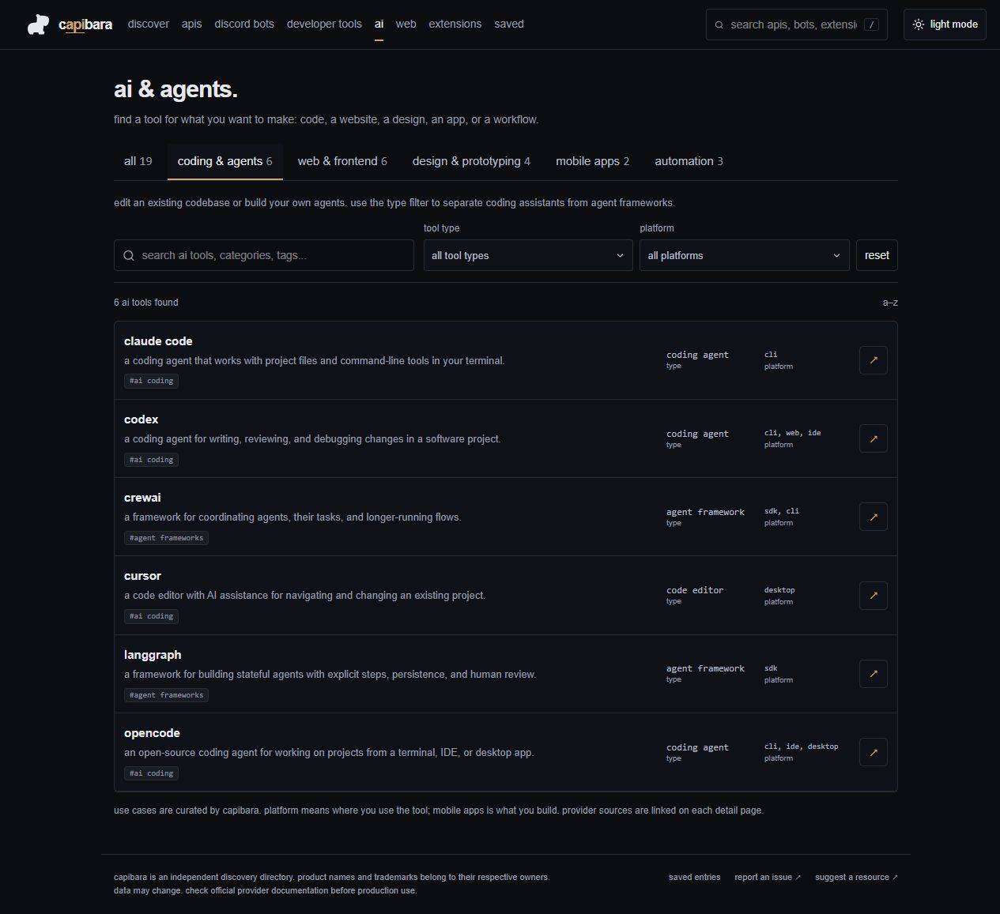

# capibara

apis, bots and developer oddities. a small, independent directory for finding useful tools and interesting corners of the web.


## inside the directory

| section | what you can find |
| --- | --- |
| apis | authentication, known pricing, free tiers, documentation, and request examples |
| discord bots | games, music, community tools, moderation, and reviewed invite links |
| developer tools | tools for building, testing, debugging, and working with data |
| ai & agents | coding assistants, agent frameworks, web builders, design, mobile apps, and automation |
| extensions | browser helpers with platform and publisher information |
| web | useful websites, weird experiments, and browser games |

Search by name, description, provider, category, or tag. Narrow games by solo/group, genre, and play style; filter extensions by browser. Collections offer starting points, and random discovery finds something unexpected.

## v2

200 unique entries: 60 APIs, 34 bots, 36 developer tools, 18 extensions, 29 websites and games, and 23 weird-web finds. Counts are a release snapshot, not usage statistics.

- **19 AI tools, five use cases:** coding & agents, web & frontend, design & prototyping, mobile apps, and automation.
- AI tools are part of the developer-tool catalog, with one record and detail page per tool. They are not counted twice.
- Fresh homepage picks on each refresh, clearer sign-in labels, keyboard-friendly dropdowns, and mobile layout fixes.
- Latest additions include OpenCode, Penpot, Replit Agent, and Board Game Arena.

See the [changelog](CHANGELOG.md) for the release summary.

Save entries locally without an account. Light and dark themes follow you between pages. Saved entries stay in that browser and disappear if its site data is cleared.

## dark mode

Coding assistants and agent frameworks share a view, with type and platform filters to separate them.



### mobile


## run locally

Use Node.js 22 (the CI version) and npm; the minimum Node.js version is 20.9. No API keys or database setup needed.

```sh
git clone https://github.com/denisilhan/capybara.git
cd capybara
npm ci
npm run dev
```

Open [localhost:3000](http://localhost:3000). The product is named **capibara**; the repository keeps its original `capybara` URL.

To continue on another computer, clone the same repository and run the steps above. For an existing checkout, commit your local work first, then use `git pull --ff-only` and `npm ci`.

For a production build:

```sh
npm run build
npm start
```

## catalog and sources

The catalog lives in [`src/data`](src/data). Each entry records sources and a review date. Unknown pricing is omitted from the interface, and unknown values are never treated as free. Direct Discord invites appear only for reviewed destinations.

Weirdness is a three-level editorial assessment, not a quality or popularity score. Legacy editorial values support some sorting and collection rules; they are not provider metrics. There are no live uptime, usage, or popularity claims.

Provider details can change. Review dates describe a source review, not a live availability guarantee. The original source audit is in [`docs/SOURCES.md`](docs/SOURCES.md); current notes live alongside each record.

To suggest an entry or correct a fact, [open an issue](https://github.com/denisilhan/capybara/issues) with its official URL and a short explanation.

## development

Next.js App Router, React, strict TypeScript, and CSS. No account system, API proxy, or tracking backend.

- `src/app/` — directory, collection, search, saved, and detail routes
- `src/components/` — shared directory and detail UI
- `src/data/` — catalog records, discovery picks, and collection rules
- `src/lib/` — search, filtering, sorting, counts, and verified links
- `tests/` — catalog invariants and route integration checks
- `public/design-lab.html` — the earlier naming and logo study

```sh
npm run lint
npm test
npm run build
```

For the release checks, start the production build with `npm start`, then run `npm run test:routes` in a second terminal. This checks every catalog detail page, directory routes, 404s, redirects, and key rendering rules. Set `TEST_BASE_URL` to use a server other than `http://127.0.0.1:3000`.

GitHub Actions runs lint, logic tests, the production build, and rendered-route tests on pushes and pull requests.

### adding a resource

1. Choose its existing catalog in `src/data/`; reuse the current entry shape and give it a unique ID and slug.
2. Write a short original description. Link official sources and record the review date; keep unverified fields `null`.
3. Choose categories and tags that describe what it does. For AI tools, set the relevant `aiAreas` on the tool record; do not create a duplicate entry.
4. Check its directory, filters, and detail page in both themes and on mobile. Update catalog-count assertions when adding records, then run the checks above.

See the [release review](docs/REVIEW.md) for the latest verification scope and limits.
